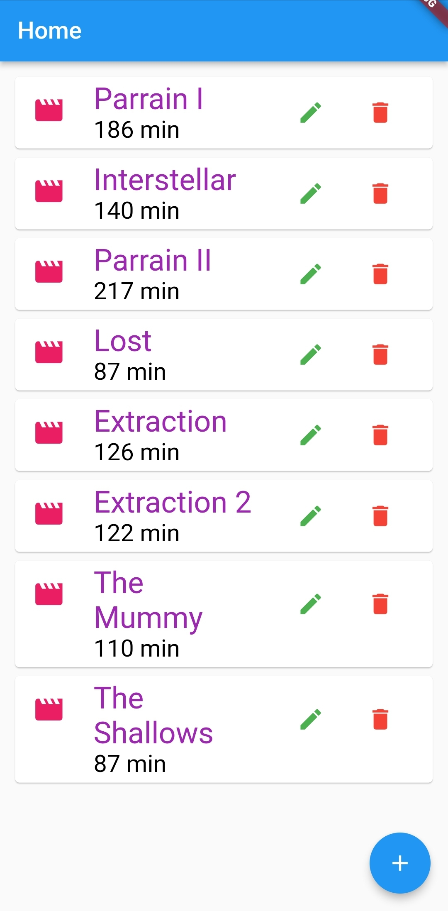
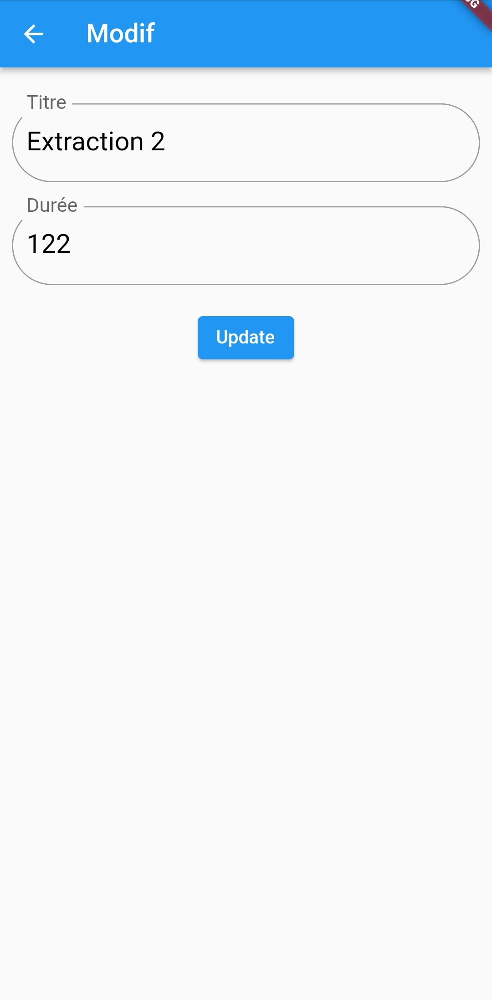

# Flutter Movies App with Local Database (Sqflite)

This is a Flutter application that allows users to manage a collection of movies using a local database (Sqflite). It provides basic CRUD (Create, Read, Update, Delete) operations for movies, allowing users to add new movies, view existing movies, update movie details, and delete movies.

## Features

- Add new movies to the collection
- View a list of all movies in the database
- Update movie details (title, description, etc.)
- Delete movies from the collection

## Screenshots

Include relevant screenshots of your app to showcase its features. For example:




## Installation

1. Clone the repository:

```bash
git clone https://github.com/your-username/flutter-movies_app.git
```

2. Change into the project directory:

```bash
cd flutter-movies_app
```

3. Install the dependencies:

```bash
flutter pub get
```

4. Run the app:

```bash
flutter run
```

Make sure you have Flutter installed on your machine and set up for your target platform (iOS or Android) before running the app.

## Database Setup

This app uses the Sqflite package for local database management. The database file is stored locally on the device.

## Contributing

Contributions are welcome! If you find any issues or want to enhance the app, feel free to submit a pull request. Please make sure to follow the code style conventions and write appropriate tests when applicable.

## License

This project is licensed under the [MIT License](LICENSE).

## Acknowledgments

- This app utilizes the Sqflite package for local database management.
- Thanks to the Flutter community for providing guidance and resources.

If you have any questions or need further assistance, please feel free to contact the project maintainer or open an issue on GitHub. Enjoy managing your movie collection with Flutter Movies App!
